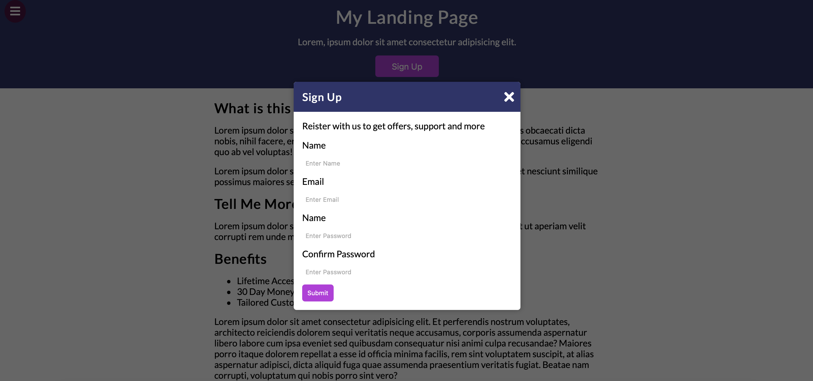

# My Landing Page

JS 보다는 CSS와 HTML 비중이 더 컸던 프로젝트

버튼을 누름으로 nav바를 표시 및 숨김처리 하는 기능.

버튼을 누름으로 modal창이 뜨고 사라지는 기능


## 1. 실행 화면

#### 1) 기본 화면


#### 2) Navbar 표시


#### 3) Modal 창 표시





## 2. 프로젝트를 통해 배운것

#### 1) `event.target` (모달 창 밖을 클릭했을 때 모달이 종료 되도록)

[영화 추천 서비스 프로젝트](https://github.com/jin0106/LCM-movie-recommendation-web)를 진행할때 구현하고 싶었던 건데 이렇게 간단할 줄이야..

css로 modal-container를 전체 화면 사이즈, modal창은 가운데 위치하게 해서 조그만하게 설정하고 아래와 같이 JS 코드를 구현해주면 끝이다.


modal-container를 클릭하면 modal창을 꺼주고 그게 아니라면 그냥 false(modal창 유지) 처리한다는 코드이다. 

```javascript
const modal = document.querySelector('.modal-container');

window.addEventListener('click', event=>{
  event.target == modal ? modal.classList.remove('show-modal') : false
})
```

