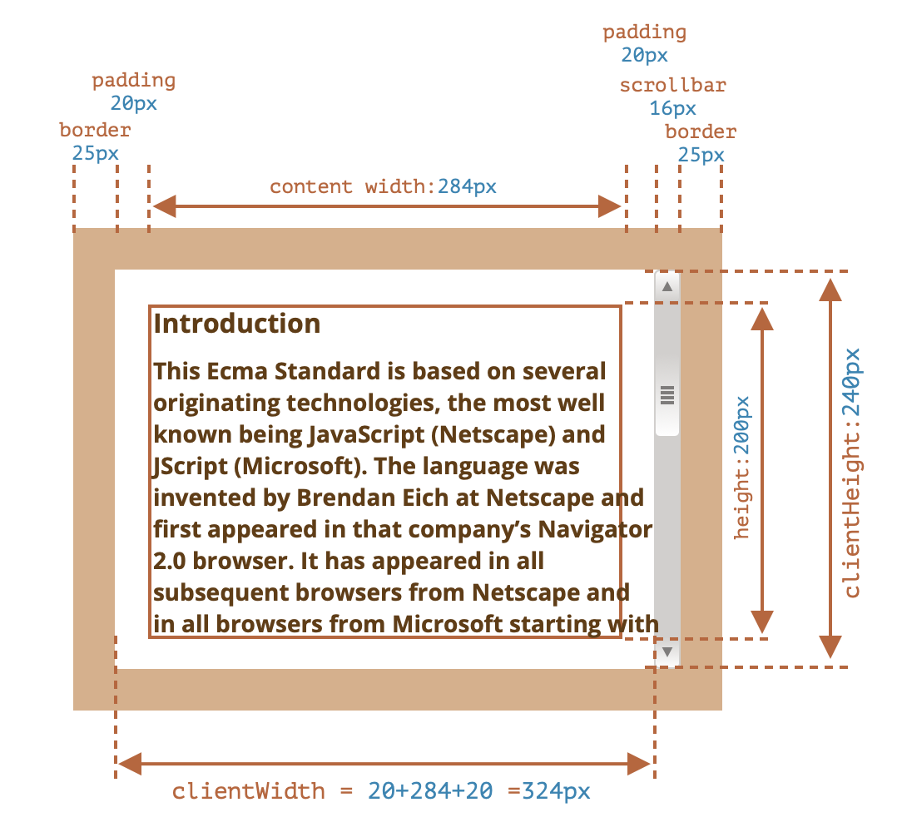
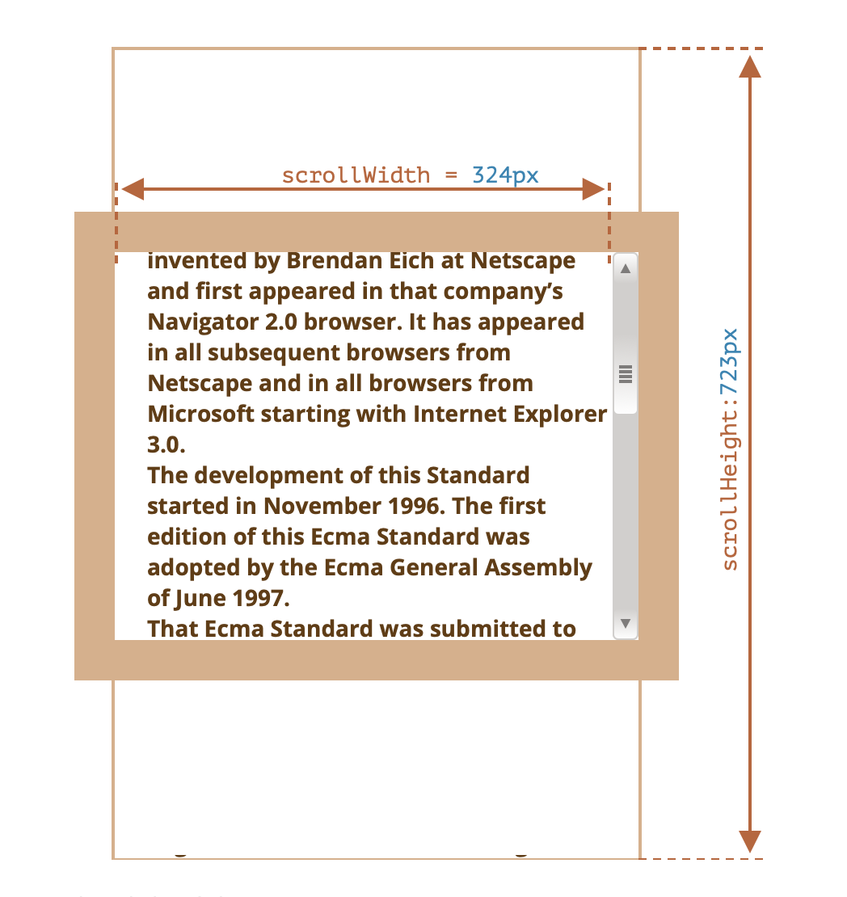

# Infinite Scroll Posts

스크롤을 제일 하단으로 내리면 새로운 포스터들이 표시가 된다.

css와 JS 의 setTimeout을 사용하여 로딩 표시 아이콘을 만들었고, setTimeout을 사용하여 .3초 뒤에 새로운 페이지들이 표시 되도록 하였다.


## 1. 실행 화면

#### 1) 기본 화면


#### 2) 로딩 화면


#### 3) 새로운 포스트들 표시


## 2. 프로젝트를 통해 배운것

#### 1) `indexOf와 forEach를 사용하여 포스터 필터 구현`

모든 포스트들을 받아와 `forEach` 를 사용하여 각각의 poste들 모두를 돌고 input의 value인 `term`이 있으면 `indexOf`가 -1 이상으로 나오므로 -1이상인 포스트들은 모든 `flex`로 표시 -1과 같거나 아래인것은 `term`이 포함되지 않았다는 것이므로 표시를 하지 않는다.

```javascript
function filterPosts(e){
  const term = e.target.value.toUpperCase();
  const posts = document.querySelectorAll('.post');

  posts.forEach(post => {
    const title = post.querySelector('.post-title').innerText.toUpperCase();
    const body = post.querySelector('.post-body').innerText.toUpperCase();
    console.log(title.indexOf(term))
    if(title.indexOf(term) > -1 || body.indexOf(term) > -1) {
      post.style.display = 'flex';
    } else {
      post.style.display = 'none';
    }
  })
}
```


#### 2) `scroll`

* clientWidth, clientHeight 프로퍼티는 테두리 안 영역의 사이즈 정보를 제공
  * 테두리 안에는 컨텐츠 너비와 패딩이 포함되는데, 스크롤바 너비는 포함되지 않는다.



* scrollWidth와 scrollHeight 프로퍼티는 스크롤바에 의해감춰진 영역도 포함한다.

  * scrollWidth는 수평 스크롤바가 없기 때문에 안쪽 영역 전체를 나타내는 clientWidth와 동일
  * scrollHeight은 스크롤 때문에 가려진 영역을 포함한 컨텐츠 영역 높이 전체

  

  

```javascript
window.addEventListener('scroll', () => {
  const {scrollTop, scrollHeight, clientHeight} = document.documentElement;

  if(scrollTop + clientHeight >= scrollHeight-5) {
    showLoading();
  }
})
```

